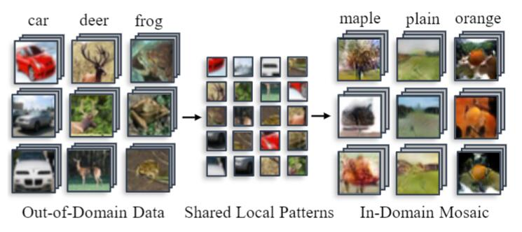
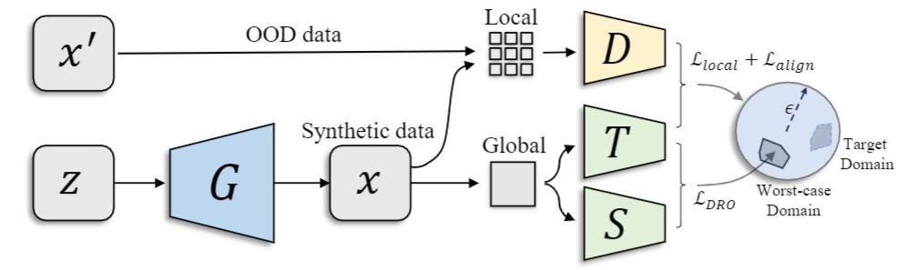
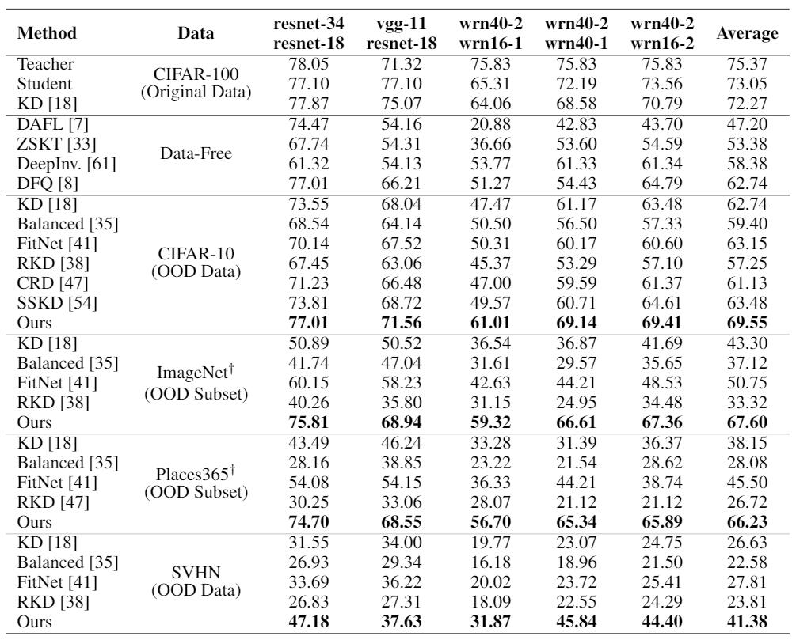
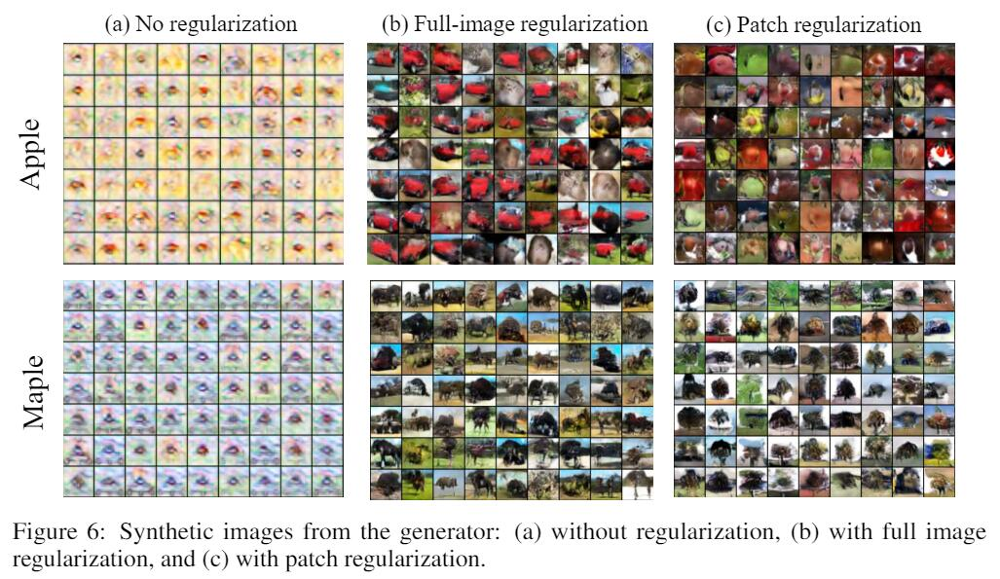

# MosaicKD
Code for NeurIPS-21 paper "[Mosaicking to Distill: Knowledge Distillation from Out-of-Domain Data](https://arxiv.org/abs/2110.15094)"

## 1. Motivation
Natural images share common local patterns. In MosaicKD, these local patterns are first dissembled from OOD data and then assembled to synthesize in-domain data, making OOD-KD feasible.

<div align="center">
</img> 
</div>

## 2. Method
MosaicKD establishes a four-player minimax game between a generator G, a patch discriminator D, a teacher model T and a student model S. The generator, as those in prior GANs, takes as input a random noise vector and learns to mosaic synthetic in-domain samples with **locally-authentic  and globally-legitimate** distributions, under the supervisions back-propagated from the other three players.
<div align="center">
</img>
</div>

## 3. Reproducing our results

### 3.1 Prepare teachers
Please download our pre-trained models from [Dropbox (266 M)](https://www.dropbox.com/sh/w8xehuk7debnka3/AABhoazFReE_5mMeyvb4iUWoa?dl=0) and extract them as "checkpoints/pretrained/*.pth". You can also train your own models as follows:
```bash
python train_scratch.py --lr 0.1 --batch-size 256 --model wrn40_2 --dataset cifar100
```

### 3.2 OOD-KD: CIFAR-100 (ID) + CIFAR10 (OOD)

* **Vanilla KD ([Blind KD](https://arxiv.org/abs/1911.05275))**
    ```bash
    python kd_vanilla.py --lr 0.1 --batch-size 128 --teacher wrn40_2 --student wrn16_1 --dataset cifar100 --unlabeled cifar10 --epoch 200 --gpu 0 
    ```

* **Data-Free KD ([DFQAD](https://arxiv.org/abs/2005.04136))**
    ```bash
    python kd_datafree.py --teacher wrn40_2 --student wrn40_1 --dataset cifar100 --epochs 200 --oh 1 --ie 20 --bn 1 --adv 1 --gpu 0
    ```

* **MosaicKD (This work)**
    ```bash
    python kd_mosaic.py --lr 0.1 --batch-size 256 --teacher wrn40_2 --student wrn16_1 --dataset cifar100 --unlabeled cifar10 --epoch 200 --lr 0.1 --local 1 --align 1 --adv 1 --balance 10 --gpu 0
    ```
    
### 3.3 OOD-KD: CIFAR-100 (ID) + ImageNet/Places365 OOD Subset (OOD)

* **Prepare 32x32 datasets**   
Please prepare the 32x32 ImageNet following the instructions from https://patrykchrabaszcz.github.io/Imagenet32/ and extract them as "data/ImageNet_32x32/train" and "data/ImageNet_32x32/val". You can prepare Places365 in the same way.

* **MosaicKD on OOD subset**    
As ImageNet & Places365 contain a large number of in-domain samples, we construct OOD subset for training. Please run the scripts with  ''--ood_subset'' to enable subset selection.

    ```bash
    python kd_mosaic.py --lr 0.1 --batch-size 256 --teacher wrn40_2 --student wrn16_1 --dataset cifar100 --unlabeled imagenet_32x32 --epoch 200 --lr 0.1 --local 1 --align 1 --adv 1 --balance 10 --ood_subset --gpu 0
    ```
<div align="center">
</img> 
</div>

                                      
## 4. Visualization of synthetic data
                                      
<div align="center">
</img> 
</div>   

                                      
## 5. Citation

If you found this work useful for your research, please cite our paper:
```
@inproceedings{fang2021mosaicking,
  title={Mosaicking to Distill: Knowledge Distillation from Out-of-Domain Data},
  author={Fang, Gongfan and Bao, Yifan and Song, Jie and Wang, Xinchao and Xie, Donglin and Shen, Chengchao and Song, Mingli},
  booktitle={Thirty-Fifth Conference on Neural Information Processing Systems},
  year={2021}
}
```
